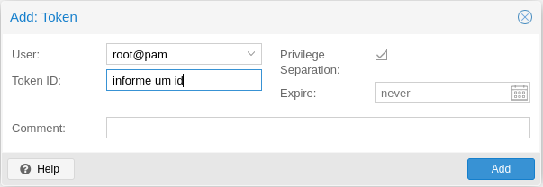

# Packer

Criando um template do Ubuntu 22.04 com packer no Proxmox 7.2

## Proxmox Config

Acesse seu servidor proxmox e crie um token de autenticação para um usuário que tenha permissão de manipular os recursos necessários para criar uma VM.
Para facilitar o teste voce pode usar o root.

Selecione Datacenter e clique em Permissions > API Tokens > Add

Salve o token secret pois ele irá aparecer apenas uma vez. É possivel gerar outro caso precise.



Verifique qual node irá usar para criar o template, é preciso informar o nome dele no arquivo ```proxmox.pkr.hcl```

Baixe a imagem do sistema operacional no storage local ou cephs destinado a isso.

## Packer Config

Adaptar o que for preciso para seu cenário

### Arquivo de variáveis

``` vars.pkr.hcl```

É preciso fazer algumas alterações:

* Alterar a URl do seu servidor proxmox
* Alterar o ID do token
* Informar o secret do token
* Altere as informações de rede de acordo com sua realidade

Este ambiente de teste foi preparado para usar IP estático, caso possua DHCP em sua rede, faça as alterações necessarias.

### Arquivo principal

``` proxmox.pkr.hcl ```

* Verifique o node em que irá gerar o template
* Informe corretamente o storage e nome da imagem a ser usada
* Revise as configurações de hardware
* Nos informes de rede do boot command, caso precise fixar o IP da sua estação de trabalho e porta, substitua os valores.
* Altere o caminho da chave privada.

### SSH

No Ubuntu 22.04 é preciso fazer ssh usando chaves pública/privada. Nos testes é usada uma chave sem senha.

```ssh-keygen -t ed25519 -C "fulano2email.br" ```

O caminho da chave privada deve ser informado no arquivo proxmox.pkr.hcl e o conteudo da chave publica no arquivo user-data

### Arquivo user-data

Este é um arquivo que define as configurações gerais do template a ser criado.

É nele que é informado o usuário a ser criado, definições de rede e repositorio de pacotes.